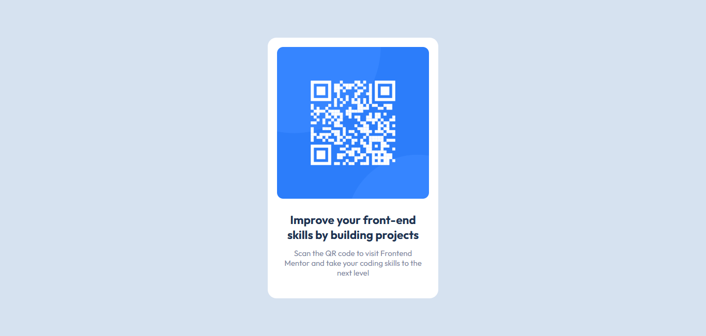

# QR Code Component

## Overview

This is a simple QR code component that allows users to scan the QR code to visit Frontend Mentor and enhance their front-end development skills. The project was built using HTML and CSS and is fully responsive, adapting to both mobile and desktop views. This challenge helped me improve my ability to create clean, efficient layouts while adhering to design specifications.

### Links

- [Live Demo](https://frontendexplorer-temp.github.io/QR-Code-Component/) 
- [Frontend Mentor Challenge](https://www.frontendmentor.io/challenges/qr-code-component-iux_sD5N)

## My Process

The project was built using **VS Code** as the development environment. The required style guide and resource files, including the QR code image, were provided by **Frontend Mentor**. I followed the design specifications to ensure that the layout and styling were in line with the guidelines.

### Built with

- HTML5
- CSS3
- [Outfit Font](https://fonts.google.com/specimen/Outfit)

### What I learned

- How to implement responsive design and create layouts that adapt across different screen sizes.
- How to style elements using external fonts and the importance of maintaining proper typography for readability.
- How to organize and apply styles efficiently using CSS.

### Continued development

- I plan to implement more complex layouts and interactive elements such as hover effects and transitions.
- Improving accessibility by ensuring better contrast and font sizes for a wider range of users.
- Experimenting with modern CSS layout techniques like Flexbox and Grid.

### Useful resources

- [Frontend Mentor](https://www.frontendmentor.io) for the challenge and design files.
- [Google Fonts](https://fonts.google.com) for providing the Outfit font used in the project.

## Author

- [FrontEndExplorer-Temp](https://github.com/FrontEndExplorer-Temp)

## Acknowledgments

A huge thanks to **Frontend Mentor** for providing the resources and challenges that allow me to practice and refine my front-end development skills. The hands-on experience from this challenge has helped me strengthen my understanding of HTML and CSS, and I look forward to tackling more challenges in the future.
